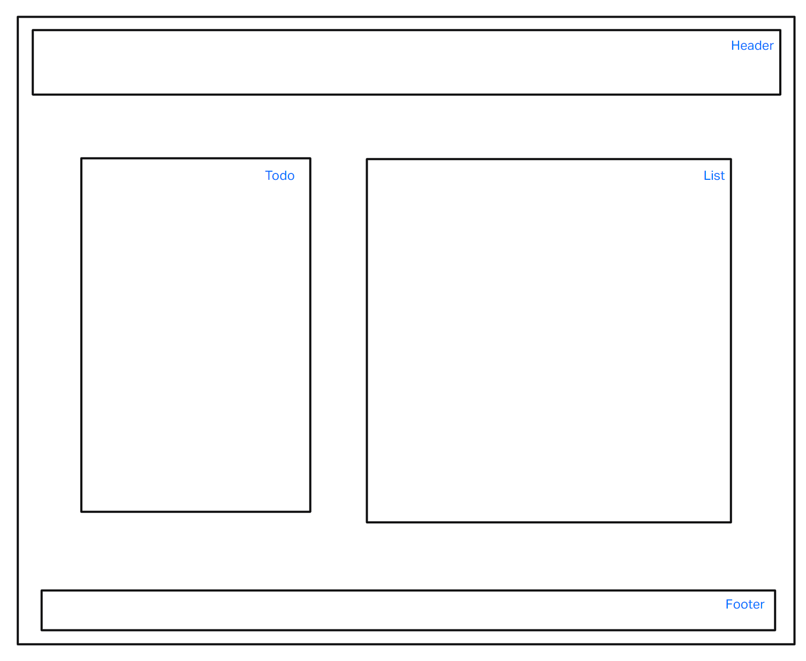

# LAB - Class 31

## Project: TODO-APP

### Author: Joe Davitt

Collaborators:
Adrienne Frey
Jordan Covington

### Problem Domain  

To Do List Manager Phase 1: Incorporate configuration settings to the application.

### Links and Resources

- [GitHub Actions ci/cd](https://github.com/j-davitt/todo-app/actions)

- [CodeSandbox](https://codesandbox.io/p/github/j-davitt/todo-app/main?file=%2FREADME.md&workspace=%257B%2522activeFileId%2522%253A%2522clfridh150000g7gygmi469w7%2522%252C%2522openFiles%2522%253A%255B%2522%252FREADME.md%2522%255D%252C%2522sidebarPanel%2522%253A%2522EXPLORER%2522%252C%2522gitSidebarPanel%2522%253A%2522COMMIT%2522%252C%2522spaces%2522%253A%257B%2522clfridj9o000x356k36y3psdr%2522%253A%257B%2522key%2522%253A%2522clfridj9o000x356k36y3psdr%2522%252C%2522name%2522%253A%2522Default%2522%252C%2522devtools%2522%253A%255B%257B%2522key%2522%253A%2522clfridj9o000y356klwjgmx8w%2522%252C%2522type%2522%253A%2522PROJECT_SETUP%2522%252C%2522isMinimized%2522%253Afalse%257D%255D%257D%257D%252C%2522currentSpace%2522%253A%2522clfridj9o000x356k36y3psdr%2522%252C%2522spacesOrder%2522%253A%255B%2522clfridj9o000x356k36y3psdr%2522%255D%252C%2522hideCodeEditor%2522%253Afalse%257D)

#### How to initialize/run your application (where applicable)

- e.g. `npm start`

#### How to use your library (where applicable)

#### Features / Routes

#### Tests

#### UML

