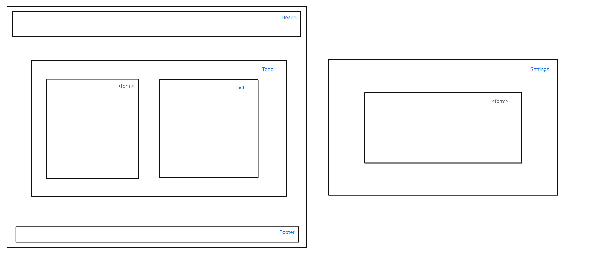

# LAB - Class 31

## Project: TODO-APP

### Author: Joe Davitt

Collaborators:
Adrienne Frey
Jordan Covington

### Problem Domain  

To Do List Manager Phase 1: Incorporate configuration settings to the application.

Phase 2: Allow user to make changes to settings.

### Links and Resources

- [GitHub Actions ci/cd](https://github.com/j-davitt/todo-app/actions)

- [CodeSandbox](https://codesandbox.io/p/github/j-davitt/todo-app/main?file=%2FREADME.md&workspace=%257B%2522activeFileId%2522%253A%2522clfridh150000g7gygmi469w7%2522%252C%2522openFiles%2522%253A%255B%2522%252FREADME.md%2522%255D%252C%2522sidebarPanel%2522%253A%2522EXPLORER%2522%252C%2522gitSidebarPanel%2522%253A%2522COMMIT%2522%252C%2522spaces%2522%253A%257B%2522clfridj9o000x356k36y3psdr%2522%253A%257B%2522key%2522%253A%2522clfridj9o000x356k36y3psdr%2522%252C%2522name%2522%253A%2522Default%2522%252C%2522devtools%2522%253A%255B%257B%2522key%2522%253A%2522clfridj9o000y356klwjgmx8w%2522%252C%2522type%2522%253A%2522PROJECT_SETUP%2522%252C%2522isMinimized%2522%253Afalse%257D%255D%257D%257D%252C%2522currentSpace%2522%253A%2522clfridj9o000x356k36y3psdr%2522%252C%2522spacesOrder%2522%253A%255B%2522clfridj9o000x356k36y3psdr%2522%255D%252C%2522hideCodeEditor%2522%253Afalse%257D)

- [CodeSandbox-lab32](https://codesandbox.io/p/github/j-davitt/todo-app/context-method?file=%2FREADME.md&workspace=%257B%2522activeFileId%2522%253A%2522clfridh150000g7gygmi469w7%2522%252C%2522openFiles%2522%253A%255B%255D%252C%2522sidebarPanel%2522%253A%2522EXPLORER%2522%252C%2522gitSidebarPanel%2522%253A%2522COMMIT%2522%252C%2522spaces%2522%253A%257B%2522clfswu38y00fe356k8wcf04ih%2522%253A%257B%2522key%2522%253A%2522clfswu38y00fe356k8wcf04ih%2522%252C%2522name%2522%253A%2522Default%2522%252C%2522devtools%2522%253A%255B%257B%2522type%2522%253A%2522TASK_LOG%2522%252C%2522taskId%2522%253A%2522start%2522%252C%2522key%2522%253A%2522clfswu8mn00m6356koolt3cd8%2522%252C%2522isMinimized%2522%253Afalse%257D%252C%257B%2522key%2522%253A%2522clfswu38y00ff356k0gusooub%2522%252C%2522type%2522%253A%2522PROJECT_SETUP%2522%252C%2522isMinimized%2522%253Afalse%257D%252C%257B%2522type%2522%253A%2522PREVIEW%2522%252C%2522taskId%2522%253A%2522start%2522%252C%2522port%2522%253A3000%252C%2522key%2522%253A%2522clfswu8jm00kk356krwv20afc%2522%252C%2522isMinimized%2522%253Afalse%257D%255D%257D%257D%252C%2522currentSpace%2522%253A%2522clfswu38y00fe356k8wcf04ih%2522%252C%2522spacesOrder%2522%253A%255B%2522clfswu38y00fe356k8wcf04ih%2522%255D%252C%2522hideCodeEditor%2522%253Afalse%257D)

#### How to initialize/run your application (where applicable)

- `npm start`

#### How to use your library (where applicable)

#### Features / Routes

#### Tests

#### UML

